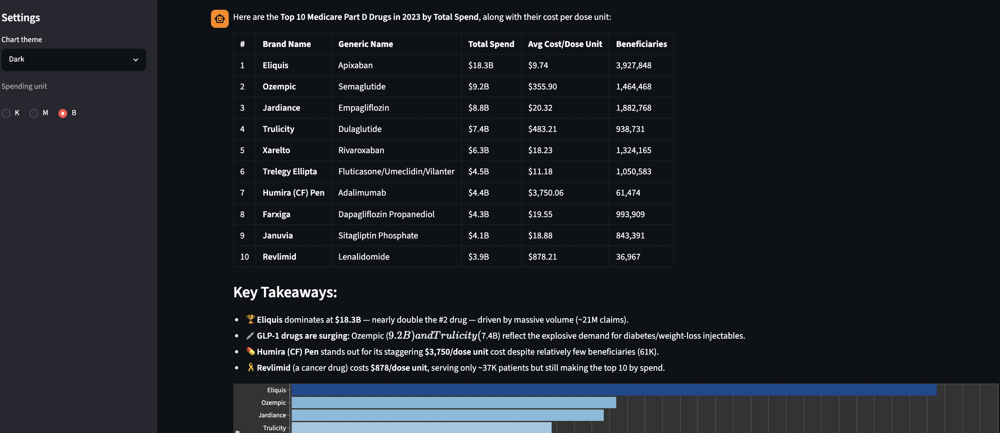
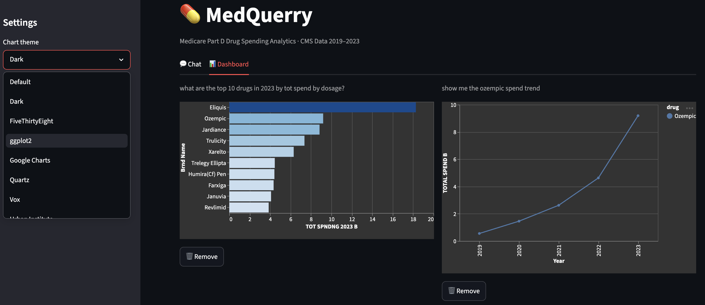

# MedQuerry

Ask questions about Medicare drug spending in plain English. Get answers, charts, and a dashboard — automatically.




---

## What it does

MedQuerry is a chat interface over CMS Medicare Part D public data — what the US government spent on prescription drugs from 2019 to 2023. You type a question in plain English, and it figures out the SQL, runs it against the data, and shows you a chart.

Some things you can ask:

- *"Which drugs had the highest total Medicare spend in 2023?"*
- *"How has Ozempic spending changed since 2019?"*
- *"Compare Eliquis and Xarelto over the last 5 years"*
- *"Which drugs are statistical cost outliers in 2022?"*
- *"Which drugs had the fastest cost growth since 2019?"*

Charts render automatically. No need to ask for one.

---

## Dashboard

Once you have a few charts in chat, you can pin them to a **Dashboard tab** for side-by-side comparison. Each chart gets a 📌 Pin button. The dashboard shows everything in a two-column grid, and you can remove individual charts from there.

---

## Sidebar controls

The sidebar has two controls that apply to every chart in the session — including ones already in your chat history and on the dashboard:

- **Chart theme** — switches the visual style of all charts at once (Default, Dark, FiveThirtyEight, ggplot2, and a few others)
- **Spending unit** — toggle between K, M, and B to rescale total spending columns to thousands, millions, or billions

---

## How it works

There are three moving parts:

**1. The data** — A single CSV file from CMS (~14,000 rows) covering 2019–2023. Every row is a drug, with columns for total spend, beneficiary count, claims, and average cost per dose unit — broken out by year.

**2. The tools** — A small Python layer exposes 5 functions that Claude can call:
- `get_schema` — tells Claude what columns exist and what they mean
- `run_sql` — runs any SQL query against the CSV using DuckDB
- `find_cost_outliers` — finds drugs with anomalous cost per dose (IQR method)
- `summarize_trends` — year-by-year breakdown for a single drug
- `compare_drugs` — side-by-side trend comparison of two drugs

**3. The loop** — Claude reads the schema, writes its own SQL, runs it, and explains the result in plain English. No queries are pre-written. Claude generates them on the fly from whatever you ask.

The tools are also exposed as an MCP server, so the same logic can plug into Claude Desktop or any other MCP client.

---

## Setup

**1. Clone and install**

```bash
git clone <repo-url>
cd MedQuerry
python -m venv .venv
source .venv/bin/activate
pip install -r requirements.txt
```

**2. Get the data**

Download the CMS Medicare Part D Spending by Drug CSV from [data.cms.gov](https://data.cms.gov/summary-statistics-on-use-and-payments/medicare-medicaid-spending-by-drug/medicare-part-d-spending-by-drug) and save it as:

```
data/medicare_part_d_spending.csv
```

**3. Add your API key**

```bash
cp .env.example .env
# paste your Anthropic API key into .env
```

**4. Run**

```bash
streamlit run app/streamlit_app.py
```

Open [http://localhost:8501](http://localhost:8501).

---

## Project structure

```
MedQuerry/
├── mcp_server/
│   ├── tools.py          # DuckDB query logic — the actual work
│   └── server.py         # MCP protocol wrapper
├── app/
│   └── streamlit_app.py  # Chat UI, chart rendering, dashboard
├── chat.py               # Claude tool-use loop (works as a CLI too)
├── data/                 # CMS CSV (not committed)
└── requirements.txt
```

---

## Tech stack

| Tool | Role |
|------|------|
| [DuckDB](https://duckdb.org) | Queries the raw CSV directly — no database to set up |
| [MCP](https://modelcontextprotocol.io) | Protocol for exposing tools to Claude |
| [Anthropic API](https://docs.anthropic.com) | Claude drives the tool-use loop and writes all the SQL |
| [Streamlit](https://streamlit.io) | Chat interface and dashboard |
| [Altair](https://altair-viz.github.io) | Charts |

---

## Dataset

**CMS Medicare Part D Spending by Drug** — published annually by the Centers for Medicare & Medicaid Services. Public domain.

Covers prescription drugs dispensed to Medicare Part D beneficiaries, 2019–2023. Each row is a drug-manufacturer combination with yearly totals for spend, claims, beneficiaries, and average cost per dose unit.

Source: [data.cms.gov](https://data.cms.gov/summary-statistics-on-use-and-payments/medicare-medicaid-spending-by-drug/medicare-part-d-spending-by-drug)
