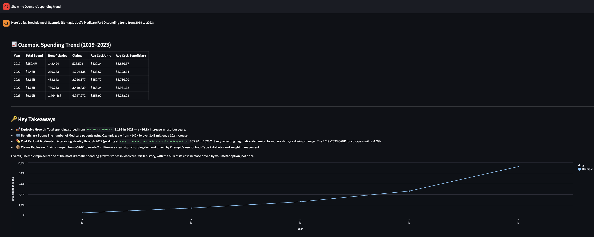

# MedQuerry

Ask questions about Medicare drug spending in plain English. Get answers and charts automatically.



---

## What it does

MedQuerry is a chat interface over CMS Medicare Part D data — public data on what the US government spent on prescription drugs from 2019 to 2023. You type a question, and it figures out the SQL, runs it, and shows you a chart.

Some things you can ask:

- *"Which drugs had the highest total Medicare spend in 2023?"*
- *"How has Ozempic spending changed since 2019?"*
- *"Compare Eliquis and Xarelto across the last 5 years"*
- *"Which drugs are statistical cost outliers in 2022?"*
- *"Which drugs had the fastest cost growth since 2019?"*

---

## How it works

There are three moving parts:

**1. The data** — A single CSV file from CMS (~14,000 rows) covering 2019–2023. Every row is a drug, with columns for total spend, beneficiary count, claims, and cost per dose unit — per year.

**2. The MCP server** — A small Python server that exposes 5 tools Claude can call:
- `get_schema` — tells Claude what columns exist and what they mean
- `run_sql` — runs any SQL query against the CSV using DuckDB
- `find_cost_outliers` — finds drugs with anomalous cost per dose (IQR method)
- `summarize_trends` — year-by-year breakdown for a single drug
- `compare_drugs` — side-by-side comparison of two drugs

**3. The chat loop** — Claude calls `get_schema` to understand the data, writes its own SQL, calls `run_sql`, and then explains the result. No queries are pre-written — Claude generates them on the fly from your question.

---

## Setup

**1. Clone and install**

```bash
git clone <repo-url>
cd MedQuerry
python -m venv .venv
source .venv/bin/activate
pip install -r requirements.txt
```

**2. Get the data**

Download the CMS Medicare Part D Spending by Drug CSV from [data.cms.gov](https://data.cms.gov/summary-statistics-on-use-and-payments/medicare-medicaid-spending-by-drug/medicare-part-d-spending-by-drug) and save it to:

```
data/medicare_part_d_spending.csv
```

**3. Add your API key**

```bash
cp .env.example .env
# open .env and add your Anthropic API key
```

**4. Run**

```bash
streamlit run app/streamlit_app.py
```

Open [http://localhost:8501](http://localhost:8501).

---

## Project structure

```
MedQuerry/
├── mcp_server/
│   ├── tools.py          # DuckDB query logic — the actual work
│   └── server.py         # MCP protocol wrapper
├── app/
│   └── streamlit_app.py  # Chat UI + chart rendering
├── chat.py               # Claude tool-use loop (also works as a CLI)
├── data/                 # CMS CSV (not committed)
└── requirements.txt
```

---

## Tech stack

| Tool | Role |
|------|------|
| [DuckDB](https://duckdb.org) | Queries the raw CSV directly — no database to set up |
| [MCP](https://modelcontextprotocol.io) | Protocol for exposing tools to Claude |
| [Anthropic API](https://docs.anthropic.com) | Claude runs the tool-use loop and writes the SQL |
| [Streamlit](https://streamlit.io) | Chat interface |
| [Altair](https://altair-viz.github.io) | Charts |

---

## Dataset

**CMS Medicare Part D Spending by Drug** — published annually by the Centers for Medicare & Medicaid Services. Public domain.

Covers prescription drugs dispensed to Medicare Part D beneficiaries, 2019–2023. Each row represents one drug-manufacturer combination with yearly totals for spend, claims, beneficiaries, and average cost per dose unit.

Source: [data.cms.gov](https://data.cms.gov/summary-statistics-on-use-and-payments/medicare-medicaid-spending-by-drug/medicare-part-d-spending-by-drug)
